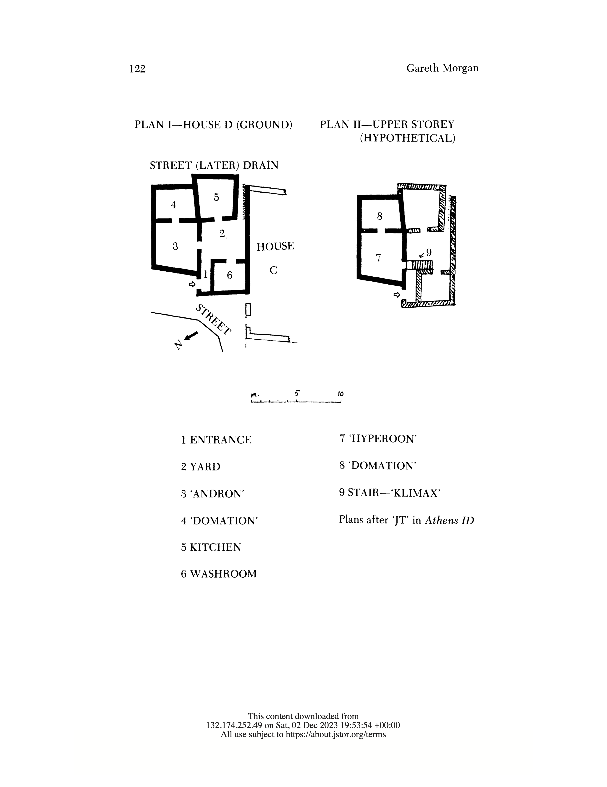
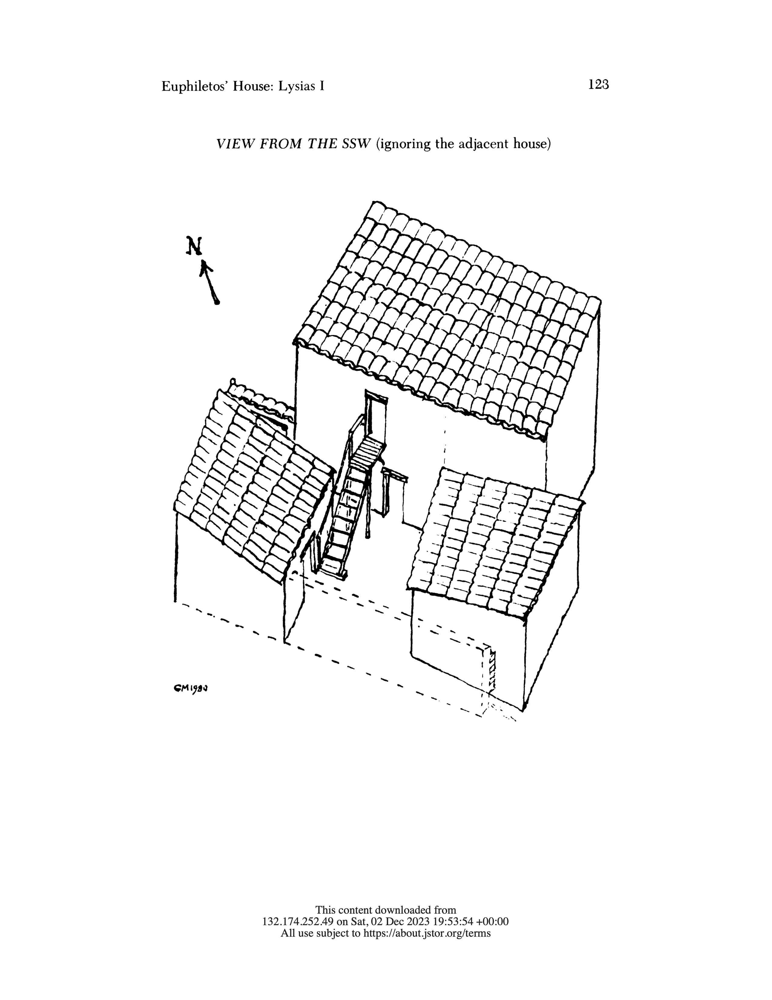

# The Greek house: what was it like physically?

> Contributed by Maddie Farrell

If the reader can understand the physical arrangement of an ancient Greek house then they will be able to better understand the roles of those who live in the οἰκία. In ancient Greek texts, we get descriptions of the house setup that have allowed researchers to construct a loose idea of what an οἰκία would look like. One text in particular that helps us is Lysias’ story of Euphiletos murdering his wife’s secret lover (Lysias, *Oration 1*). The setup of his house is especially significant as to how Eratosthenes, the secret lover, was able to sneak around and to Euphiletos’ testimony in court. The main components of Euphiletos’ two-storied house include the principal room and inner room on both the upper level and lower, an external staircase in the yard, a washing facility, and a kitchen. There was a divide between the women’s quarters and the men’s quarters. In Euphiletos’ house The upper level was the women’s apartment and the lower level was the men’s apartment; these living quarters were of equal size. The walls were made from adobe brick but there were possibly wooden partition walls that may have been used to divide a room. The separation of the servants by gender would allow the owners of the house to prevent servants from having children with each other. 

> **TBA**: we should offer a brief note here on how the specific example in the preceding paragraph and the general patterns summarized in the following paragraph could help us imagine Ischomachus' house as described in the *Oeconomicus*. 

Separation and organization were key aspects of the household. Dwelling rooms were positioned to be cool in summer warm by shade and warm in winter by sunlight. Certain rooms and areas would serve different purposes like a cool cellar for wine or a warm, dry room for bread making. Objects, like armor, utensils, or decorations, would have certain spots in the house that the servants would be responsible for. The owners of the οἰκία would decide how their house was organized and taught their servants where things
belonged. 

In discussing the house in Lysias, 1 Gareth Morgan includes plans and a reconstruction of an excavated Greek house reproduced here.  The section labelled "Andron" is interpreted as the men’s dining room, potentially used for symposiums. The "Domation" in an inner room (bedroom). The "Hyperoon" is the principal upstairs room, potentially the living quarters of the women.

> *Illustration 1*. From Morgan, p. 122: plan of extant ground floor, and proposed plan of upper floor.

> *Illustration 2*. From Morgan, p. 123: reconstruction.

## Sources

- Morgan, Gareth. “Euphiletos’ House: Lysias I.” *Transactions of the American Philological Association* (1974-) 112 (1982): 115–23. DOI: [https://doi.org/10.2307/284074](https://doi.org/10.2307/284074).